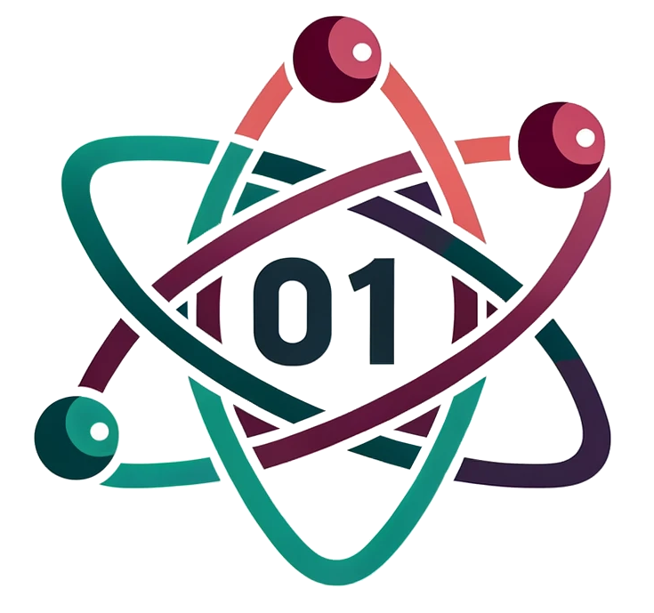

<!-- Header -->
@@jumbotron,jumbotron-fluid,no-pad
  @@container
    ~~~
    
    <h2>Numerical Methods  in Quantum Information Science</h2>
    Summer School at the Mt Ida campus of UMass Amherst on the outskirts of Boston
    ~~~

    @@buttons
      ~~~
      <a class="btn btn-primary btn-lg" href="https://qnumerics.org/register" role="button"><i class="fas fa-user-plus"></i> Register</a>
      ~~~
    @@
  @@
@@

@@features
  @@container
    @@row
      @@col-md-12,feature-title
        ~~~
        <h2>Target audience</h2>
        ~~~
        Folks with baseline QIS and programming skills searching to significantly expand them.
      @@
    @@
    @@row
      @@col-md,feature
        ~~~
        <h5>Graduate Students, Postdocs, and Professionals</h5>
        ~~~
        Graduate students, postdocs, and professionals in Quantum Information Science who want to supercharge their classical programming skills in terms of:
      @@
      @@col-md,feature
        ~~~
        <h5>Exceptional Undergraduates</h5>
        ~~~
        Talented undergrads will be admitted on case-by-case basis after reviewing their applications. Free admission and travel grants will be available to undergraduates.
      @@
      @@col-md,feature
        ~~~
        <h5>Hackers</h5>
        ~~~
        The summer school will end with a hackathon where participants are empowered to make their first contribution to an open source project, flesh out the first software steps necessary for a novel result in QIS, or design and control quantum hardware.
      @@
    @@
  @@
@@

@@features
  @@container
    @@row
      @@col-md-12,feature-title
        ~~~
        <h2>Cirriculum</h2>
        ~~~
        Providing significant breadth of skills in QIS.
      @@
    @@

    @@row
      @@col-md,feature
        ~~~
        <h5>General software engineering practices and cluster computing tools</h5>
        ~~~
      @@
      @@col-md,feature
        ~~~
        <h5>Advanced general scientific programming (ODEs, optimization, autodifferentiation)</h5>
        ~~~
      @@
      @@col-md,feature
        ~~~
        <h5>GPU programming</h5>
        ~~~
      @@
    @@

    @@row
      @@col-md,feature
        ~~~
        <h5>Fast general purpose wavefunction simulation</h5>
        ~~~
      @@
      @@col-md,feature
        ~~~
        <h5>Tensor networks for faster approximate quantum simulations</h5>
        ~~~
      @@
      @@col-md,feature
        ~~~
        <h5>Stabilizer formalism for quantum ECC</h5>
        ~~~
      @@
    @@

    @@row
      @@col-md,feature
        ~~~
        <h5>Discrete event simulations (e.g. for networking)</h5>
        ~~~
      @@
      @@col-md,feature
        ~~~
        <h5>Quantum chemistry</h5>
        ~~~
      @@
      @@col-md,feature
        ~~~
        <h5>Symbolic computer algebra basics</h5>
        ~~~
      @@
    @@
    @@row
      @@col-md,feature
        ~~~
        <h5>Optimal control of quantum hardware</h5>
        ~~~
      @@
      @@col-md,feature
        ~~~
        <h5>APIs for control of commercial quantum hardware</h5>
        ~~~
      @@
      @@col-md,feature
        ~~~
        <h5></h5>
        ~~~
      @@
    @@

  @@
@@

@@friends
  @@container
    @@row
      @@col-md-12,feature-title
        ~~~
        <h2>Sponsors, Presenters, and Instructors</h2>
        ~~~
      @@
    @@

    @@row
      @@col-md
        ~~~
        
        ~~~
      @@
      @@col-md
        ~~~
        
        ~~~
      @@
      @@col-md
        ~~~
        
        ~~~
      @@
      @@col-md
        ~~~
        
        ~~~
      @@
      @@col-md
        ~~~
        
        ~~~
      @@
      @@col-md
        ~~~
        
        ~~~
      @@

    @@

  @@
@@
